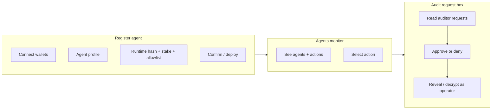
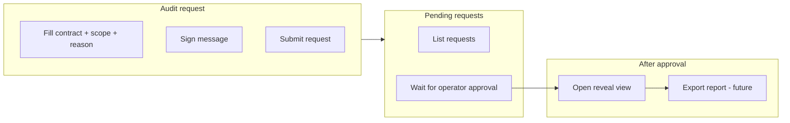
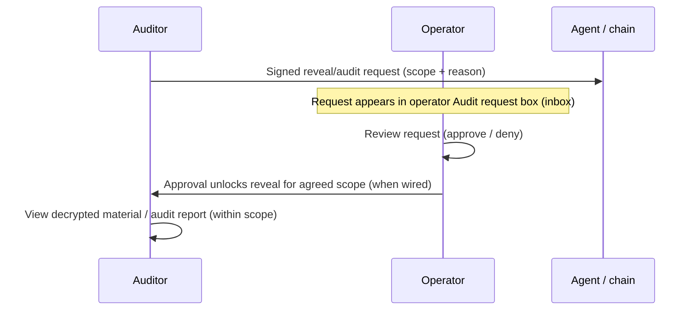

# SEAL dashboard flows — Operator & Auditor

This document describes the **intended user journeys** for the operator and auditor dashboards, and how they connect around **selective reveal**. It matches the current frontend structure (`Operators_Dash`, `Auditors_Dash`) and calls out what is **UI-only** vs **still to wire** where the code says so.

---

## Shared context

- **Operator** runs and stakes an agent; they control whether an auditor’s **reveal request** is approved (within policy / allowlist).
- **Auditor** asks to inspect reasoning or execution evidence for a scoped set of actions or time range; approval unlocks **reveal** for that scope.
- Both paths assume **EVM wallet** identity in the UI today; copy also references **NEAR** for the full agent story (registry / multi-chain).

---

## Operator flow (`/dashboard/operator`)

**Entry:** Path A — Operator dashboard (“Control room”).

Three tabs:

| Tab | Purpose |
|-----|---------|
| **Register agent** | Wizard to connect wallet, choose agent profile, bind TEE runtime hash, set stake, set reveal allowlist, then confirm/deploy. |
| **Agents monitor** | View registered agents and per-action pipeline (commitment, stages, reveal status). Select an action for context used elsewhere. |
| **Audit request box** | **Inbox:** incoming reveal/audit requests from auditors; approve/deny (when wired). Side panel: selective reveal tooling for the operator’s own agent data. |

### End-to-end (conceptual)

### Register agent (wizard steps)

1. Connect **EVM** wallet (NEAR connect described as future in UI).
2. **Agent profile** (e.g. Treasury Manager vs future roles).
3. Paste **TEE runtime hash** (binds identity to enclave build).
4. **Stake** amount and read slash preview.
5. **Reveal allowlist** — addresses allowed to *request* reveals (multisig-friendly).
6. **Confirm and deploy** — mint/register agent and lock stake (contract + registry integration when implemented).

### Agents monitor

- Lists **agents** (status, stake, health, last action).
- Lists **actions** with commitment hash, stage trace, and reveal state (e.g. encrypted vs pending request).
- Selecting an action updates **context** used when moving to the audit tab (selected action id).

### Audit request box (operator inbox)

- **Inbox:** each item shows auditor, scope, reason, timestamp, status (pending / approved / denied).
- **Approve / deny** — intended to record on-chain or in backend; buttons may show “coming soon” until wired.
- **Reveal view** — operator can use **SelectiveRevealPanel** for their own agent; this is separate from auditor unlock but uses the same conceptual “reveal” machinery.

---

## Auditor flow (`/dashboard/auditor`)

**Entry:** Path B — Auditor portal.

Two-column layout:

| Section | Purpose |
|---------|---------|
| **1) Audit request form** | Target **agent contract address**, **scope** (full history, time range, or specific actions), **reason**, optional org metadata. |
| **2) Pending requests** | List of requests the auditor submitted in this session; status and (when approved) access to reveal UI. |

### End-to-end (conceptual)

### Requesting a reveal (audit request)

1. Connect **EVM** wallet (auditor identity).
2. Enter the **agent contract address** to audit (must be a valid address).
3. Choose **scope:** full history, a **time range**, or specific **action IDs**.
4. Enter **reason** (included in the signed payload).
5. Optionally add **organisation** label.
6. **Sign + submit request** — builds a deterministic message, signs with the wallet, appends to local **pending requests** list.

**Note:** The auditor UI states that **on-chain submission** and **operator notification** are the next integration step; today the list is **session-local** unless backend sync exists.

### After submit

- Each request shows **pending** until an operator (or automation) marks it **approved** or **denied** (in the full product, via operator inbox / contract events).
- When **approved**, the auditor can open **Reveal view** (modal): copy describes unlocked actions, trace, export — some controls remain **coming soon** until wired.

---

## How operator and auditor flows meet

**Product intent:** the auditor never gets raw reasoning until the **operator** (or policy tied to the **allowlist** from registration) approves the request. The **register** step’s allowlist defines *who may ask*; the **inbox** is where those asks land and get decided.

---

## Implementation pointers (code)

| Area | Location |
|------|----------|
| Operator shell + tabs | `frontend/src/components/dashboard/Operators_Dash.tsx` |
| Register wizard | `frontend/src/components/dashboard/operator/OperatorRegisterTab.tsx` |
| Monitor | `frontend/src/components/dashboard/operator/OperatorMonitorTab.tsx` |
| Audit inbox + reveal | `frontend/src/components/dashboard/operator/OperatorAuditTab.tsx` |
| Auditor portal | `frontend/src/components/dashboard/Auditors_Dash.tsx` |

---

## Summary

| Role | Primary actions |
|------|----------------|
| **Operator** | Register and stake an agent → monitor agents and actions → **open audit request inbox**, approve/deny auditor asks, run **selective reveal** as needed. |
| **Auditor** | **Request a reveal** (signed audit request with scope and reason) → track pending items → after approval, **view reveal** / export audit artifacts. |

Together, these flows implement **gated transparency**: commitments are public; **reasoning and detailed execution evidence** are revealed only after an explicit, attributable request and operator (or policy) approval.
